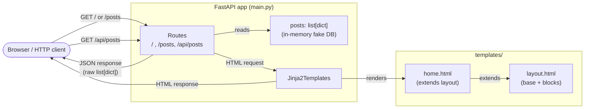
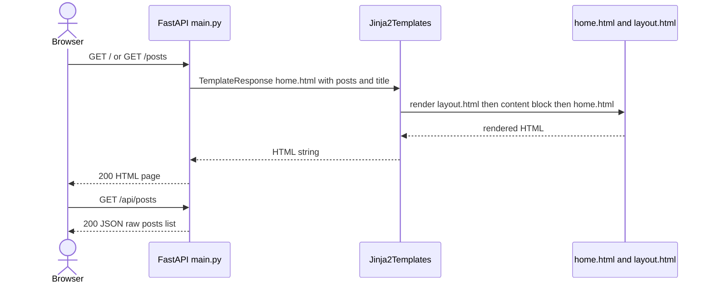
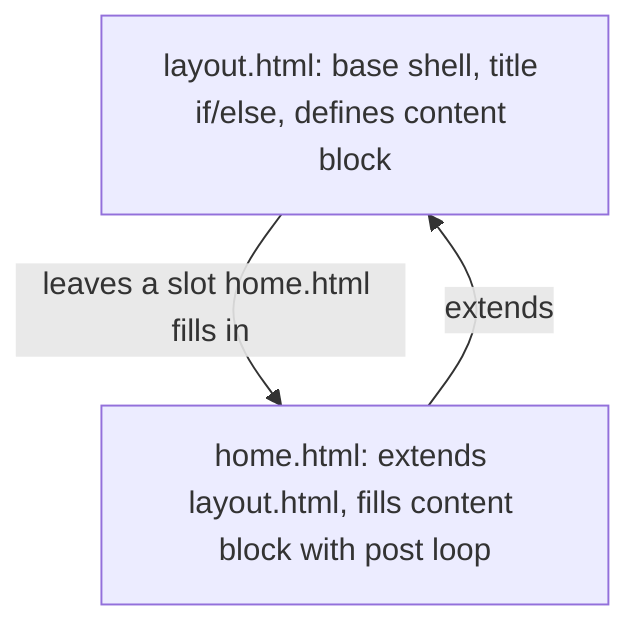

<h1 align="center" style="font-family: 'Sora', sans-serif;">FastAPI + Jinja2 Learning Blog</h1>

<p align="center" style="font-family: 'Sora', sans-serif;">
  <em>A hands-on FastAPI project built while following the
  <a href="https://www.youtube.com/watch?v=7AMjmCTumuo&list=PL-osiE80TeTsak-c-QsVeg0YYG_0TeyXI">FastAPI course</a>.</em>
</p>

<p align="center">
  <a href="https://fonts.google.com/specimen/Sora">Sora</a> font is used for headings/key-concept
  callouts below. GitHub's markdown sanitizer strips inline <code>style</code> attributes, so these
  render in the intended font in VS Code preview / any browser-rendered markdown viewer, and fall
  back to the system font on github.com. The content is identical either way.
</p>

---

## What this repo is

A small, real backend (not just a script) for practicing FastAPI fundamentals: routing, request
handling, server-rendered HTML with Jinja2, and the shape of a typical "blog" app. Every concept is
learned by building — no boilerplate copy-paste.

## End goal

Ship a simple HTML-backed blog backend where:

- Visitors can browse a list of posts and read a single post, server-rendered (no JS framework).
- Posts live in a real database instead of an in-memory Python list.
- There's a form-based flow to create/edit/delete posts.
- The same data is available as a clean JSON API alongside the HTML pages.
- The app has basic error handling, static assets, and can be run/deployed like a real service.

---

## Progress

### Done

| Concept | Where |
|---|---|
| Project scaffolding with `uv` (`pyproject.toml`, lockfile, pinned Python) | [`pyproject.toml`](./pyproject.toml), [`.python-version`](./.python-version) |
| FastAPI app instance + basic `GET` routes | [`main.py`](./main.py) |
| One handler mapped to two routes (`/` and `/posts`) | [`main.py`](./main.py) |
| Hiding routes from the OpenAPI docs (`include_in_schema=False`) | [`main.py`](./main.py) |
| Separate raw JSON API endpoint (`/api/posts`) alongside the HTML pages | [`main.py`](./main.py) |
| In-memory fake DB (`list[dict]`) to stand in for a real database | [`main.py`](./main.py) |
| `Jinja2Templates` wiring + `TemplateResponse` | [`main.py`](./main.py), [`templates/home.html`](./templates/home.html) |
| Dynamic rendering with `` loops over server data | [`templates/home.html`](./templates/home.html) |
| Conditional rendering with `/` (dynamic `<title>`) | [`templates/layout.html`](./templates/layout.html) |
| Template inheritance — shared `layout.html` + `` | [`templates/layout.html`](./templates/layout.html), [`templates/home.html`](./templates/home.html) |

Concept-by-concept notes with diagrams live in [`docs/`](./docs) — see [`docs/README.md`](./docs/README.md).

### Remaining

- [ ] Real database (SQLite via SQLAlchemy) instead of the in-memory `posts` list
- [ ] Single-post detail route (`/posts/{id}`)
- [ ] Create / update / delete routes backed by HTML forms
- [ ] Static files (CSS/JS) served via `StaticFiles`
- [ ] Flash/toast messages for form actions
- [ ] Custom 404 / 500 error pages
- [ ] Basic auth for the write routes
- [ ] Tests (routes + template rendering)
- [ ] Deployment notes

---

<h2 style="font-family: 'Sora', sans-serif;">Architecture (current state)</h2>



<h2 style="font-family: 'Sora', sans-serif;">Request flow: HTML page vs JSON API</h2>



<h2 style="font-family: 'Sora', sans-serif;">Template inheritance</h2>



---

## Setup & running the project

This project uses [`uv`](https://docs.astral.sh/uv/) for dependency and environment management —
that's what `pyproject.toml` / `uv.lock` / `.python-version` are for.

### 1. Prerequisites

- Python 3.13+ (pinned in [`.python-version`](./.python-version))
- [`uv`](https://docs.astral.sh/uv/getting-started/installation/) installed

### 2. Clone & install

```bash
git clone <this-repo-url>
cd fast-api-learn
uv sync
```

`uv sync` creates `.venv/` and installs everything pinned in `uv.lock`, including
`fastapi[standard]` (FastAPI + Uvicorn + the dev CLI).

### 3. Run the dev server

```bash
uv run fastapi dev main.py
```

Or, equivalently:

```bash
uv run uvicorn main:app --reload
```

### 4. Try it out

| URL | What you get |
|---|---|
| http://127.0.0.1:8000/ | Server-rendered blog home page |
| http://127.0.0.1:8000/posts | Same page, second route to the same handler |
| http://127.0.0.1:8000/api/posts | Raw JSON list of posts |
| http://127.0.0.1:8000/docs | Auto-generated Swagger UI (HTML routes hidden via `include_in_schema=False`) |

---

## Project layout

```
fast-api-learn/
├── main.py              # FastAPI app, routes, in-memory "posts" data
├── templates/
│   ├── layout.html       # base template: <title> logic + content block
│   └── home.html         # extends layout.html, loops over posts
├── docs/                 # concept notes + diagrams (see docs/README.md)
├── pyproject.toml        # project + dependency metadata (uv)
├── uv.lock               # locked dependency versions
└── .python-version       # pinned Python version for uv
```
