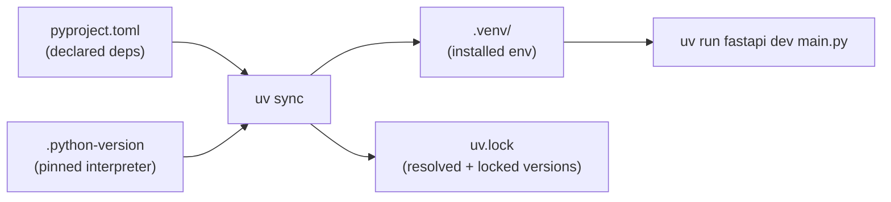

<h1 style="font-family: 'Sora', sans-serif;">01 · FastAPI Basics & Project Setup</h1>

<p style="font-family: 'Sora', sans-serif;"><strong>Key concept:</strong> a FastAPI app is just an
instance of <code>FastAPI()</code>, and every route is a Python function decorated to say which
HTTP method + path it answers.</p>

## Project setup with `uv`

- `pyproject.toml` declares the project + dependencies (`fastapi[standard]`).
- `.python-version` pins the interpreter (`3.13`) so `uv` always provisions the right one.
- `uv.lock` locks exact dependency versions for reproducible installs.
- `uv sync` reads all three and builds `.venv/`.
- `uv run <cmd>` runs a command inside that environment without manually activating it.



## Minimal app shape

```python
from fastapi import FastAPI

app = FastAPI()

@app.get("/")
def home():
    return {"message": "hello"}
```

- `app = FastAPI()` — the ASGI application object; Uvicorn serves this.
- `@app.get("/")` — registers a route for `GET /`. FastAPI infers the return value's shape and
  auto-generates OpenAPI docs from it.
- `fastapi dev main.py` (or `uvicorn main:app --reload`) — runs a dev server with hot reload.

<p style="font-family: 'Sora', sans-serif;"><strong>Why it matters:</strong> everything else in
this project (templates, JSON APIs, forms, DB-backed routes later) hangs off this same
"decorated function = route" model.</p>
