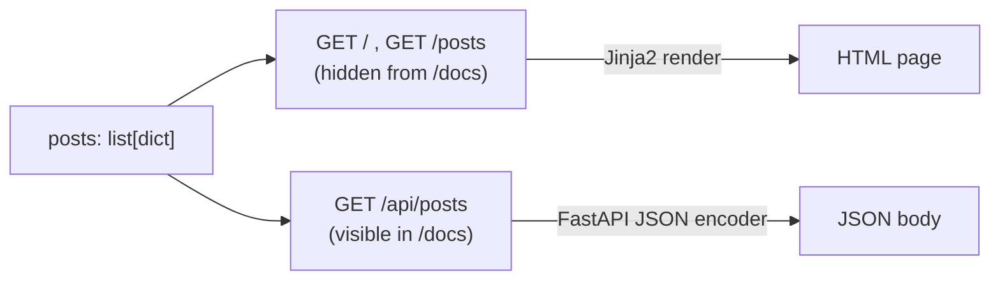

<h1 style="font-family: 'Sora', sans-serif;">02 · Routing, Hidden Docs & JSON APIs</h1>

<p style="font-family: 'Sora', sans-serif;"><strong>Key concept:</strong> one function can answer
multiple routes, and a route can be hidden from the auto-generated docs while still being fully
live and callable.</p>

## Stacking two routes on one handler

```python
@app.get("/", include_in_schema=False)
@app.get("/posts", include_in_schema=False)
def home(request: Request):
    return templates.TemplateResponse(
        request, "home.html", {"posts": posts, "title": "Home"},
    )
```

Both `/` and `/posts` call the exact same function. Decorators stack top-to-bottom — FastAPI just
registers the function twice, once per path.

## `include_in_schema=False`

FastAPI auto-builds a Swagger UI at `/docs` from every route. HTML page routes aren't really
"API operations" a client would call for JSON, so they're hidden from that schema with
`include_in_schema=False` — the route still works, it just doesn't clutter `/docs`.

## Splitting HTML vs JSON

```python
@app.get("/api/posts")
def get_posts():
    return posts
```

Same underlying data (`posts`), two different response shapes:



<p style="font-family: 'Sora', sans-serif;"><strong>Why it matters:</strong> this is the seed of a
"headless-friendly" backend — the same data source can serve a server-rendered page and a real
JSON API without duplicating logic.</p>
