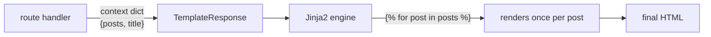

<h1 style="font-family: 'Sora', sans-serif;">03 · Jinja2Templates & Dynamic Rendering</h1>

<p style="font-family: 'Sora', sans-serif;"><strong>Key concept:</strong>
<code>Jinja2Templates</code> turns a template file + a Python dict of context data into an HTML
response — no manual string concatenation.</p>

## Wiring it up

```python
from fastapi.templating import Jinja2Templates

templates = Jinja2Templates(directory="templates")

@app.get("/")
def home(request: Request):
    return templates.TemplateResponse(
        request, "home.html", {"posts": posts, "title": "Home"},
    )
```

- `directory="templates"` — where `.html` template files live.
- `TemplateResponse` needs the `request` object (Starlette requirement) plus the template name and
  a context dict — every key in that dict becomes a variable inside the template.

## Looping over data with ``

```jinja

  <h2>{{ post.title }}</h2>
  <p>{{ post.author }}</p>

```

- `{{ post.title }}` — "dot access" into a dict, same syntax as attribute access. Jinja2 tries
  attribute access first, then falls back to `dict[key]` — so this works whether `post` is a dict
  or an object.
- The loop body re-renders once per item in `posts`, so adding a post to the Python list is enough
  to add a rendered block — no template changes needed.



<p style="font-family: 'Sora', sans-serif;"><strong>Why it matters:</strong> this is the core
loop (pun intended) of server-rendered apps — Python data in, HTML out, with the template staying
dumb and the data staying in Python.</p>
