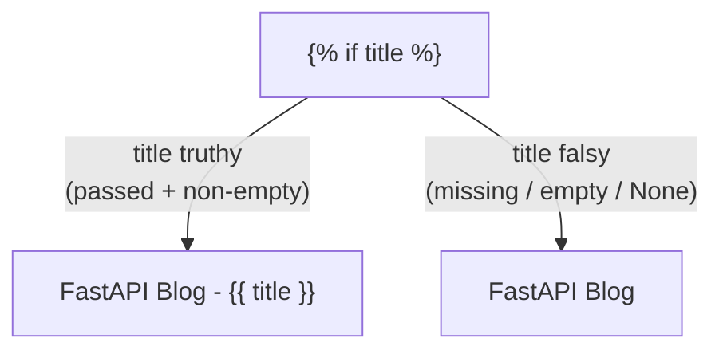

<h1 style="font-family: 'Sora', sans-serif;">04 · Jinja2 Conditionals</h1>

<p style="font-family: 'Sora', sans-serif;"><strong>Key concept:</strong>
<code>/</code> lets a template change its output based on whether a context
variable was passed in at all — not just its value.</p>

## Dynamic `<title>` in `layout.html`

```jinja
<title>
   FastAPI Blog - {{ title }}  FastAPI Blog 
</title>
```

- If the route passes `"title": "Home"` in the context dict, `title` is truthy → renders
  `FastAPI Blog - Home`.
- If a route never includes a `title` key at all (or it's empty), `title` is falsy in Jinja2 →
  falls back to plain `FastAPI Blog`.



## Why this matters for a shared layout

`layout.html` is used by every page (via inheritance — see next note). Not every route needs to
set a custom title, so the `` guard means `layout.html` degrades gracefully instead of
rendering `FastAPI Blog - None` or throwing an error when `title` is missing.

<p style="font-family: 'Sora', sans-serif;"><strong>Why it matters:</strong> templates that assume
every variable is always present break the moment a new route forgets to pass one. Guarding with
<code></code> makes the shared layout safe to reuse everywhere.</p>
