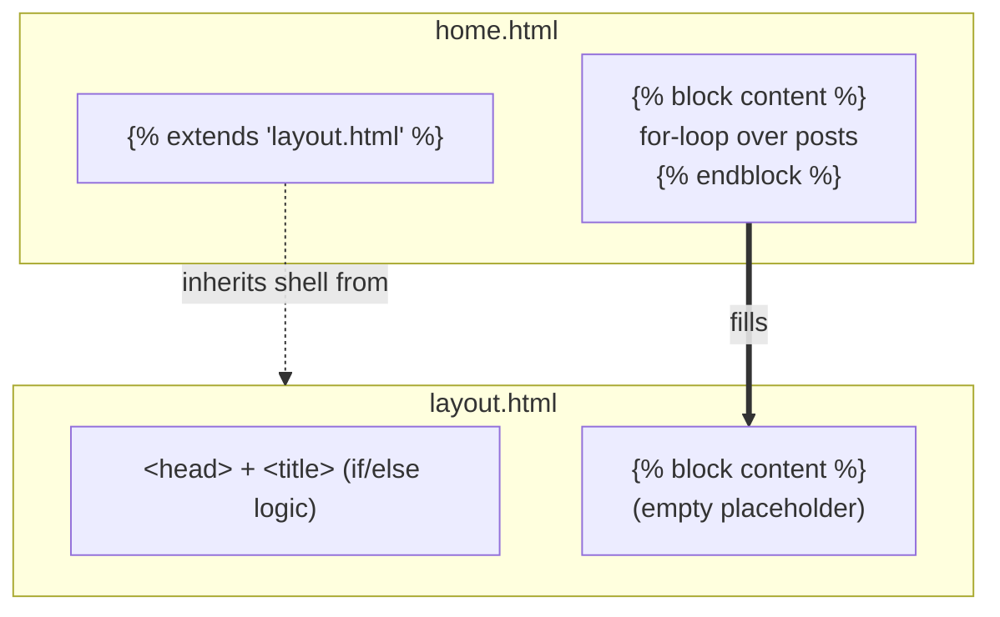

<h1 style="font-family: 'Sora', sans-serif;">05 · Template Inheritance</h1>

<p style="font-family: 'Sora', sans-serif;"><strong>Key concept:</strong>
<code></code> + <code></code> let one base template own the shared page
shell, while each page template only fills in the parts that differ.</p>

## The base: `layout.html`

```jinja
<!doctype html>
<html lang="en">
  <head>
    <title> FastAPI Blog - {{ title }}  FastAPI Blog </title>
  </head>
  <body>
     
  </body>
</html>
```

`` is a named slot. On its own, it renders empty — it's a placeholder for a
child template to override.

## The child: `home.html`

```jinja


  
    <h2>{{ post.title }}</h2>
    <p>{{ post.author }}</p>
  

```

- `` must be the first line — it says "render `layout.html`, but let me
  override its blocks."
- Everything inside ` ... ` in `home.html` replaces the empty
  block of the same name in `layout.html`.
- Anything outside a `` in a child template is ignored — only block overrides matter.



## Why this replaced copy-pasted HTML

Before inheritance, every page would need its own `<head>`, `<title>` logic, etc. duplicated. Now:

- One place (`layout.html`) owns the `<head>`, title logic, and page shell.
- New pages (post detail, create-post form, etc.) just `` and define
  their own `` — no boilerplate duplication.

<p style="font-family: 'Sora', sans-serif;"><strong>Why it matters:</strong> this is what makes
adding more pages later (post detail, forms, error pages) cheap — each new template is just its
unique content, not a full HTML document.</p>
